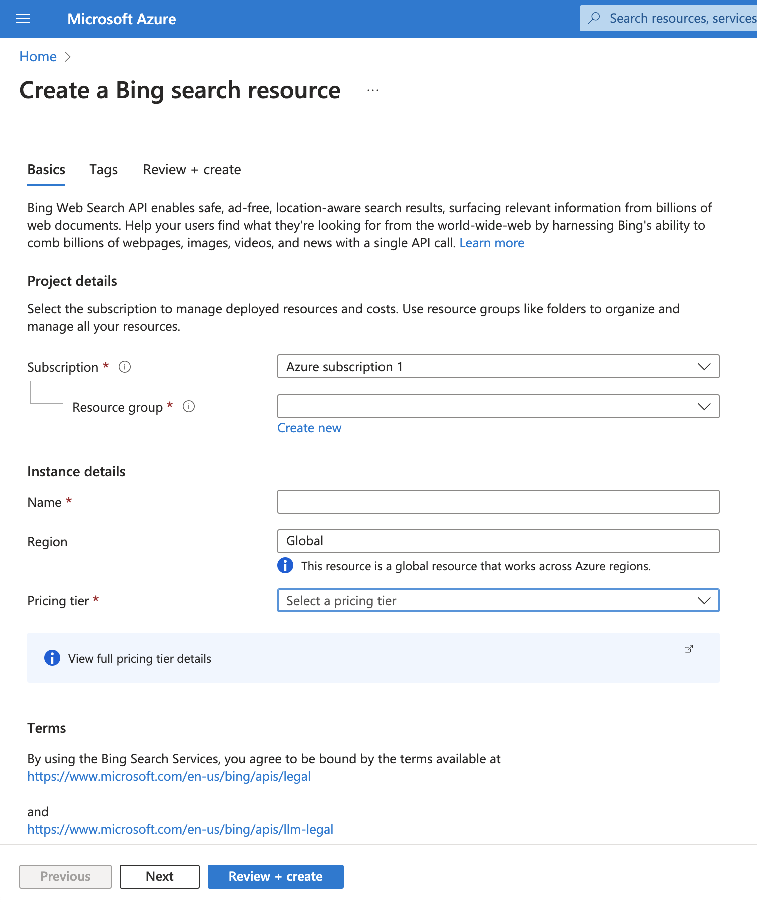
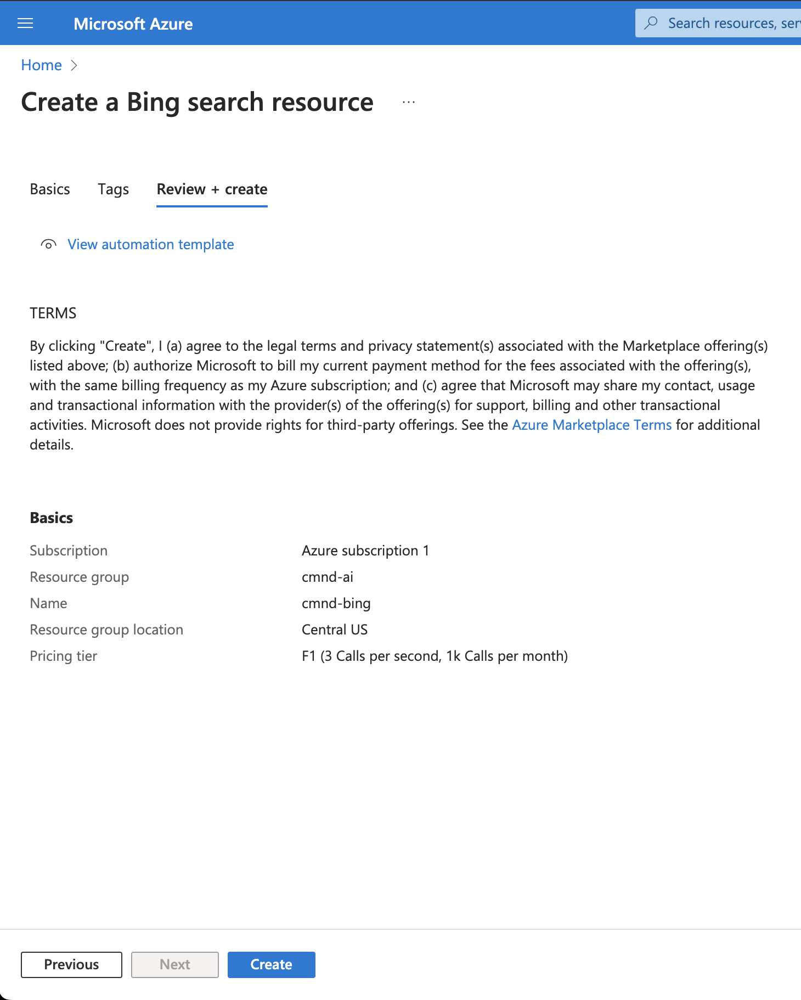
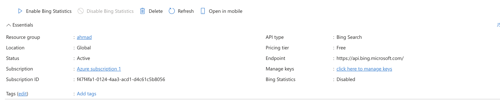
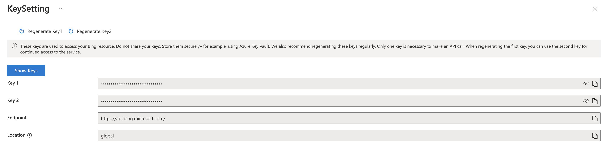

# How to Obtain an Azure Bing Search API Key

This guide will help you acquire a Bing Search API key from Azure.

## Prerequisites

- **Azure Account**: An Azure account is required. No credits are needed if you make fewer than 1,000 requests per day.

---

## Steps to Get Your Azure Bing Search API Key

### 1. **Navigate to the Bing Web Search API Page**

- Visit the **[Bing Web Search API page](https://portal.azure.com/#create/microsoft.bingsearch/)**.

  

- Under the **Project Details** section:

  - Choose your subscription.
  - Select an existing resource group or create a new one by clicking **Create new**.

- Under the **Instance Details** section:

  - Enter a name for your instance.
  - Choose your preferred region.
  - Select a pricing tier that fits your requirements.

- Specify the location for the resource group based on your preference.

- Click **Review + Create**, review the summary of your resource, and then click **Create**.

  

- Wait a few seconds for the deployment to complete, and you’re all set!

---

### 2. **Locate Your API Key**

- Once the resource is set up, search for the Bing resource in the Azure portal search bar.

- Select the resource you just created. You’ll see a page like this:  
  

- Click **Click here to manage keys**.

- In the **Key Settings**, you’ll find two keys. You can use either of them.

  
