# WhatsApp Chatbot Integration

This guide explains how to integrate a WhatsApp chatbot with CMND, enabling automated messaging and customer interactions through WhatsApp's platform.

## Prerequisites

Before getting started, ensure you have:

- A Facebook Account.
- A Meta Developer Account: [Create a Meta Developer Account](https://developers.facebook.com/docs/development/register).
- A CMND account with chatbot creation access.

## Steps to Set Up WhatsApp API

### 1. Create a Meta App

Navigate to [Meta developers platform](https://developers.facebook.com/apps/).

- Click **Create App** to begin the setup process.
  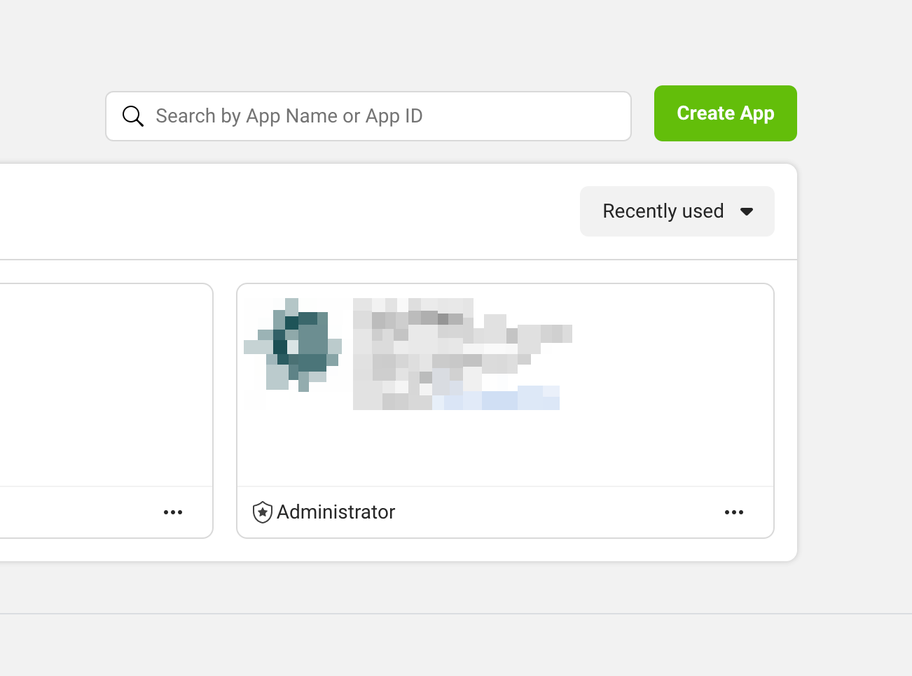

- Enter your app name and contact email, then click **Next**.
  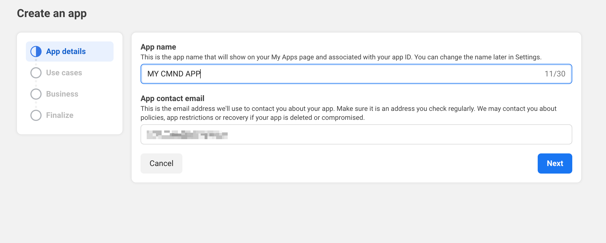

- Select **other** as your use case, then click **Next**.
  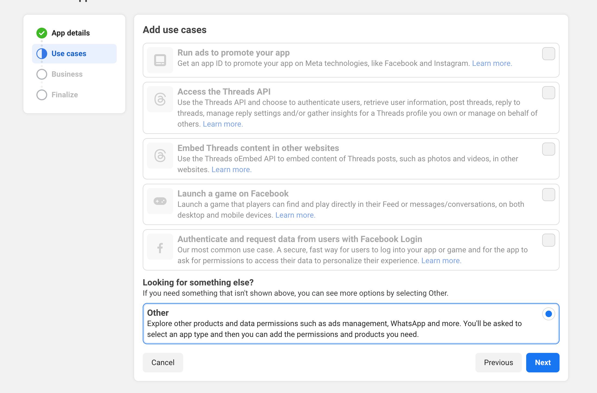

- Select **Business** as the app type, then click **Next**
  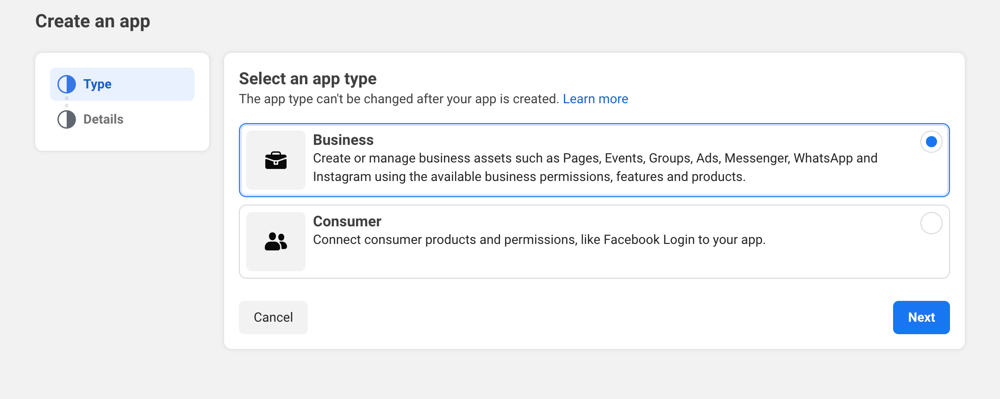

- Optionally select a **Business portfolio** and click **Create App**.
  :::note
  You will be prompted to enter you facebook password.
  :::

  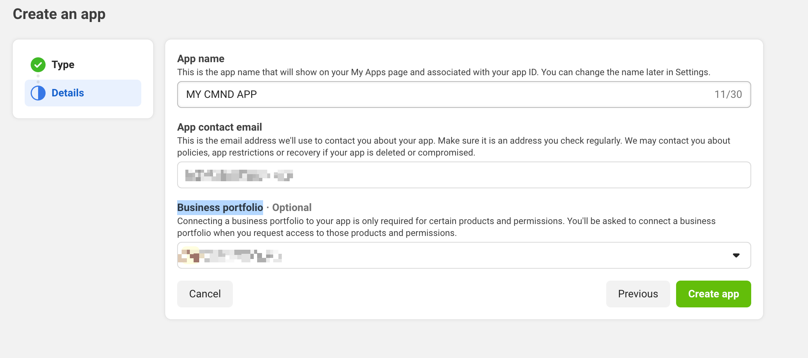

### 2. Set Up WhatsApp in Meta App

- In your Meta App dashboard, locate and click the **Setup** button under the **WhatsApp**.
  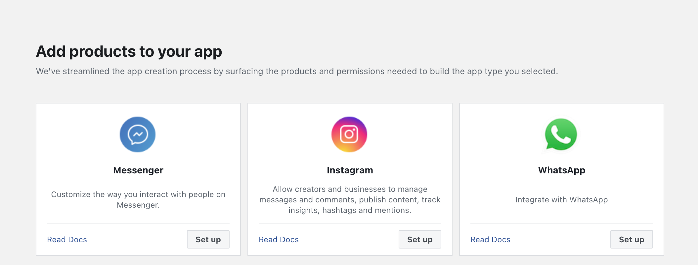

- Click on **start using the API**.
  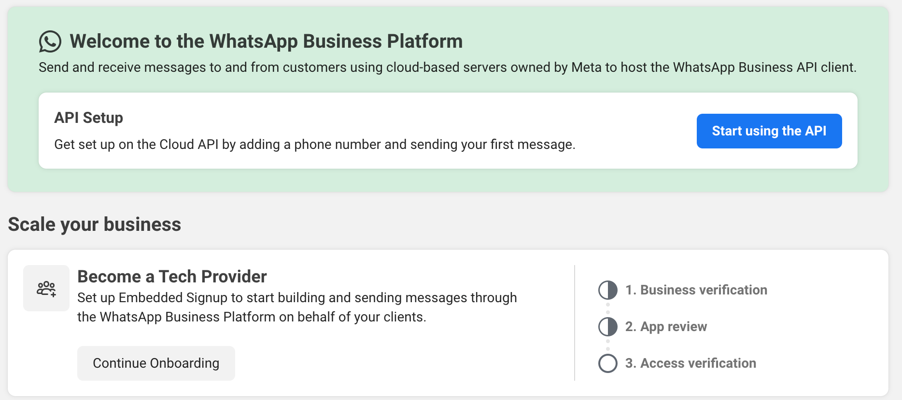

- Generate an **access token**
  :::note
  You will be prompted to enter you facebook password.
  :::
  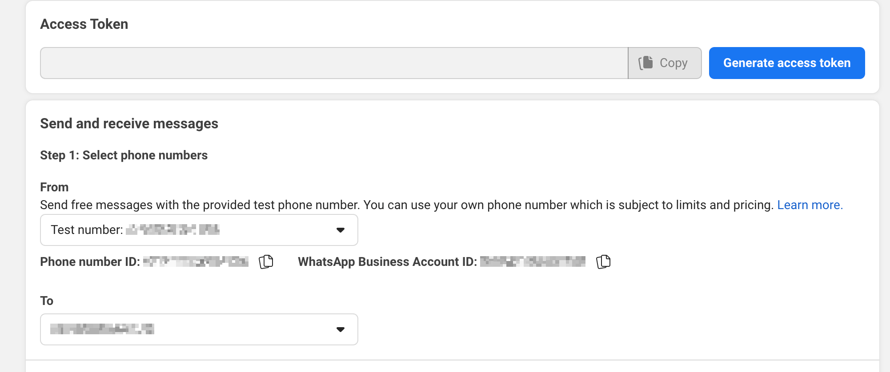

### 3. Integrating with CMND

- Go to the **embed** tab of your chatbot settings on CMND and select **Use on Chat Platform** and click **Add Credentials**.
  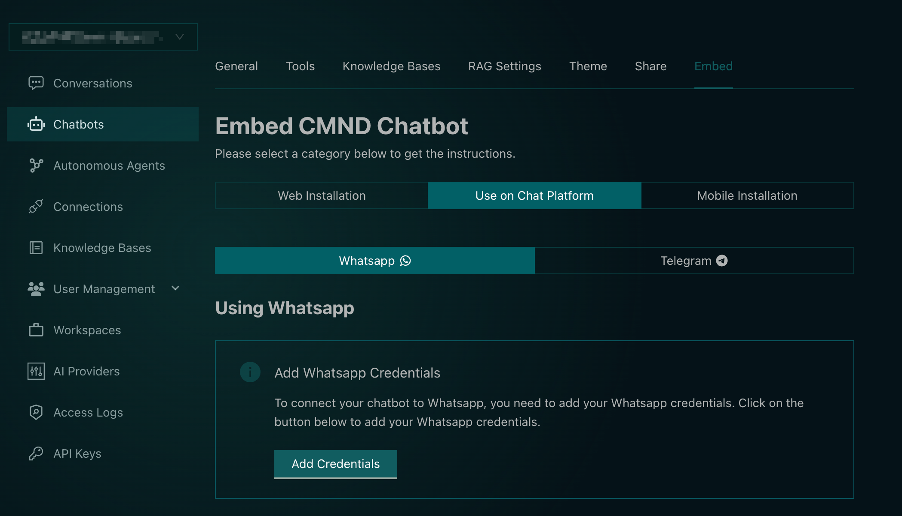

- Copy the following details from your Meta App dashboard:
  - **Phone number ID** (labeled as _Phone Id_)
  - **WhatsApp Business Account ID** (labeled as _Account Id_)
  - **Access token**  
    Paste these credentials into the **Add WhatsApp Credentials** modal in CMND and
    click **Submit** to save your configuration.
    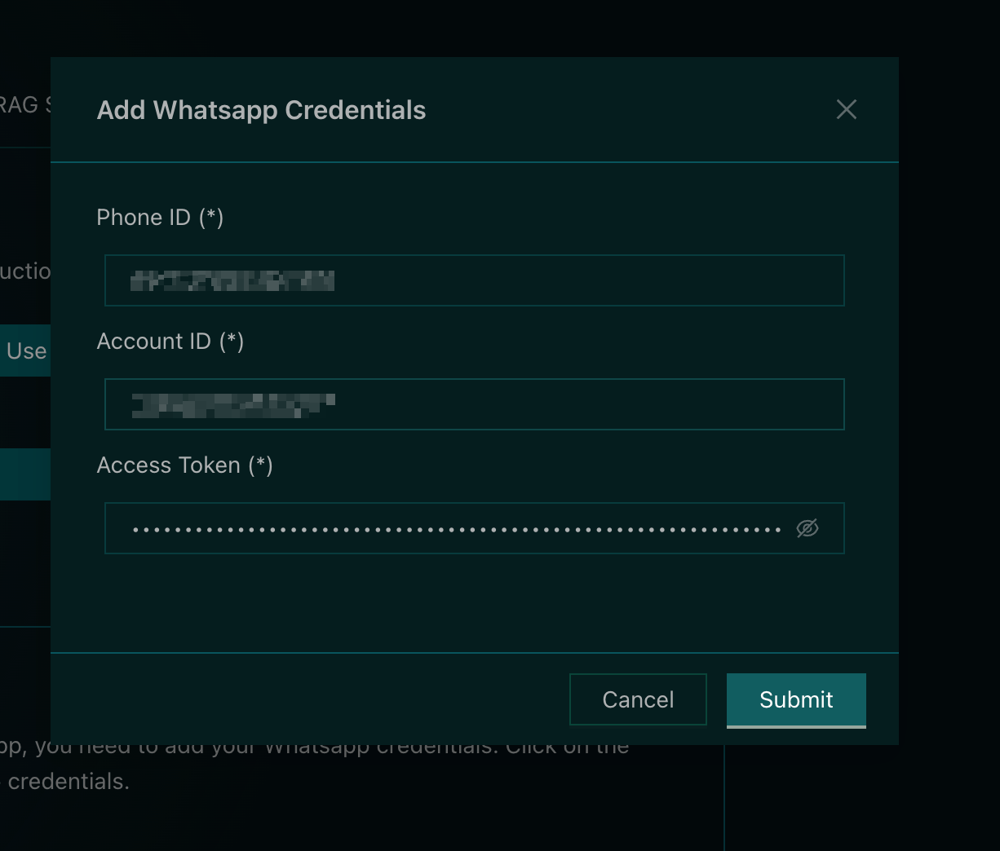
    :::note
    After submitting, you'll receive a webhook URL which will be needed in the next steps.
    :::

### 3. Configuring your webhook

- On Meta App Dashboard ensure you have the app you created selected then click on **Configuration** under WhatsApp on the sidebar. Copy and paste your webhook URL obtained from the previous step in the **Callback URL** field, then click **Verify and Save** to save your configuration.
  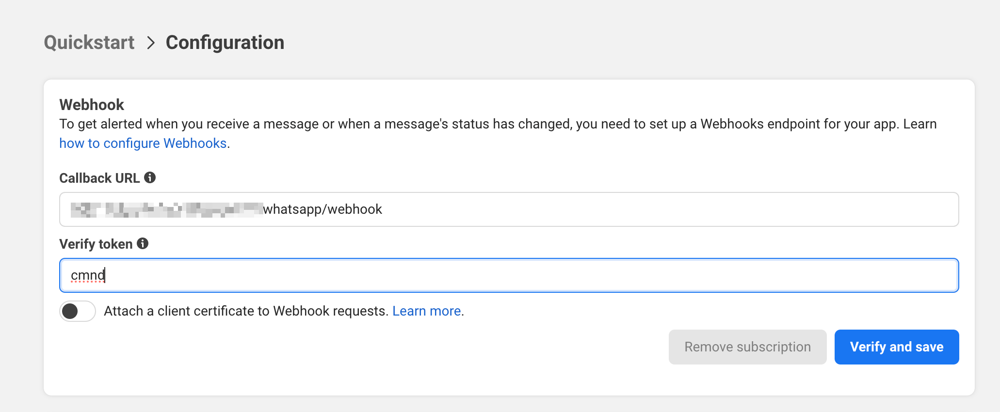

- You will need to subscribe to the **messages** callback in the **Webhook fields**.
  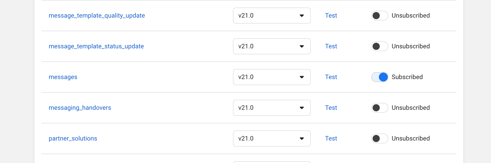

### 4. Sending a test message

- If your Meta developers account is not verified you may select a test number on the **From** field and add or select an active whatsapp phone number in the **To** field.
- You will need to generate a new access token to send a test message.
  :::warning
  Do not forget to update your access token on CMND whenever you generate a new one.
  :::

- Proceed by clicking **Send message**
  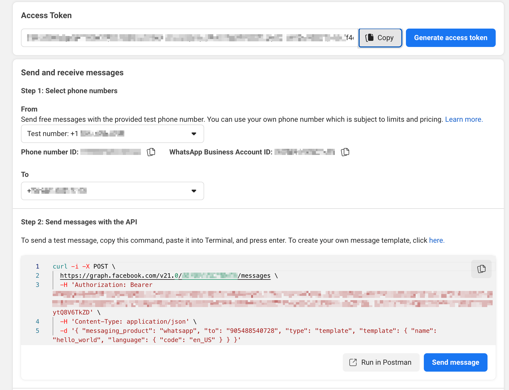

- You should receive a message from the test number you have selected. Feel free to reply and your chatbot should respond to your messages via this number.
  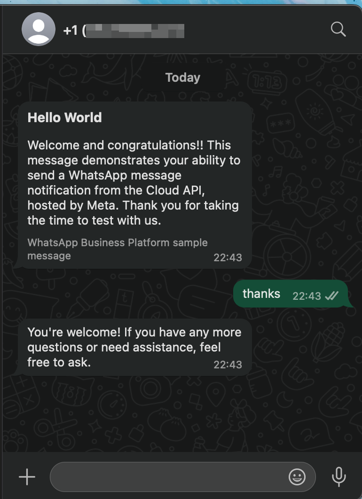

### 5. Next Steps

- **Business Verification:**
  Click [here](https://developers.facebook.com/docs/development/release/business-verification) to learn more about business verification, you will need to be a verified business on meta to receive and send messages to any number for you choice.

You may also check out [Meta App Development Docs](https://developers.facebook.com/docs/development) for more information.
