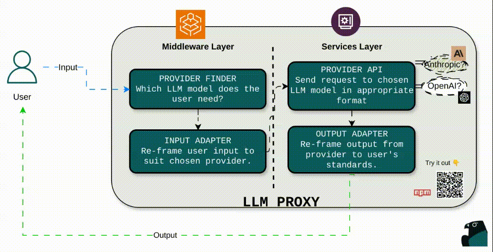
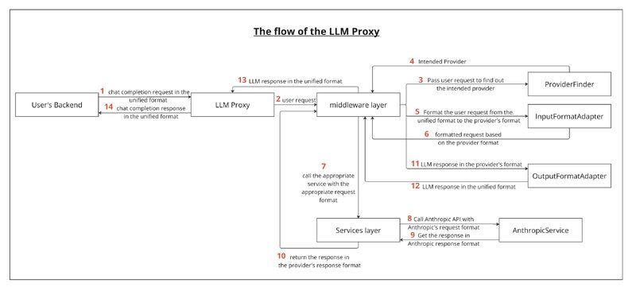

# LLM Proxy

**llm-proxy** is an open-source abstraction layer for large language models (LLMs) like OpenAI, Anthropic, and others. It provides a clean, unified interface for sending and receiving LLM requests — making it easier to build flexible, provider-agnostic AI features in your apps.

We built it to simplify the overhead of managing multiple providers, normalize their differences, and support dynamic routing logic in real production systems.

Whether you're experimenting or shipping, LLM Proxy helps you focus on your product — not your LLM wiring.

:::info
📦 [npm Package](https://www.npmjs.com/package/llm-proxy)
:::

---

## How it works

LLM Proxy sits between your application and the LLM providers you use. From a single entrypoint, it figures out which provider to use, adapts the input format to what that provider expects, executes the request, and returns a clean, consistent response.

This makes it easy to:

- Swap providers (or add fallbacks) without rewriting logic
- Streamline request/response handling
- Keep your app logic simple and decoupled from LLM-specific quirks

---

## Architecture

LLM Proxy is structured into two core layers:

### Middleware Layer

- **Provider Resolver**  
  Routes the request to the appropriate LLM provider, based on runtime config, user input, or defaults.

- **Input Adapter**  
  Maps app-level input into the format expected by the target provider.

### Services Layer

- **Provider Client**  
  Executes the actual API call (e.g., to OpenAI or Anthropic) and handles any errors or retries.

- **Output Adapter**  
  Transforms the response back into a normalized, provider-agnostic format for your app.

---

## Get Involved

We believe great developer tools should be open — and built with developers in mind.

LLM Proxy is open source, extensible, and ready for your ideas. If you want to add new providers, improve the internals, or help shape its future — we’d love to have you involved.

**Github:** **[https://www.github.com/CyprusCodes/llm-proxy](https://github.com/CyprusCodes/llm-proxy)**

Explore the code, open an issue, submit a PR, or just [reach out](mailto:info@cmnd.ai) :)

Let’s make LLM infrastructure better — together.
