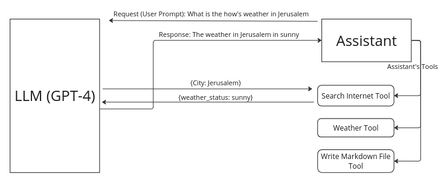

# What are Tools?

Tools serve as a means to enable the Language Learning Model (LLM) to perform tasks that it initially lacks the capability to execute. For instance, if an assistant lacks the ability to search the internet, a tool can bridge this gap by accessing online resources to support the assistant's primary task. For instance, if a user prompt requests information about "CMND.ai", but the LLM have not been trained on a data that contains information about CMND.ai, the LLM receives this prompt and autonomously decides to employ a predefined tool to scour the internet for relevant information on the topic. Subsequently, the LLM processes and formats this retrieved data before presenting it to the user as an answer.

When considering the creation of a tool, the focus lies in providing the assistant with functionalities to aid its task execution. For instance, if we aim to develop an assistant capable of retrieving weather information, and the assistant lacks the ability to access real-time data, we must equip it with a function to perform this task. Such a function can be an API, database query, or any mechanism capable of returning relevant data.

Regarding the interaction between tools and assistants, the process unfolds as follows: Upon receiving a user prompt, such as "What is the weather in Jerusalem," the LLM autonomously identifies the need for a tool to accomplish the task, as it lacks the capability to do so itself. Subsequently, the LLM extracts relevant parameters (City: Jerusalem) from the user prompt and utilizes them to execute the tool (function). The function then carries out the necessary task and returns the data. Finally, the assistant utilizes this retrieved data to formulate the final response to the user.

## The interaction between Large Language Models (LLMs), Assistants, and Tools

