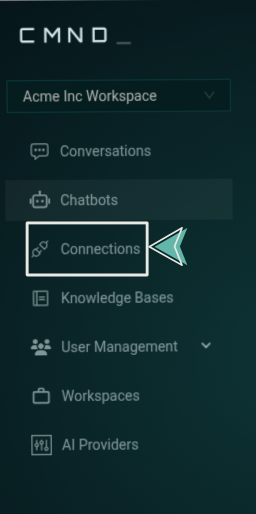
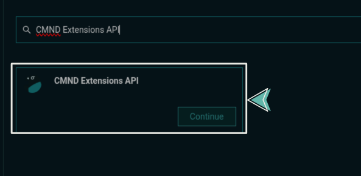
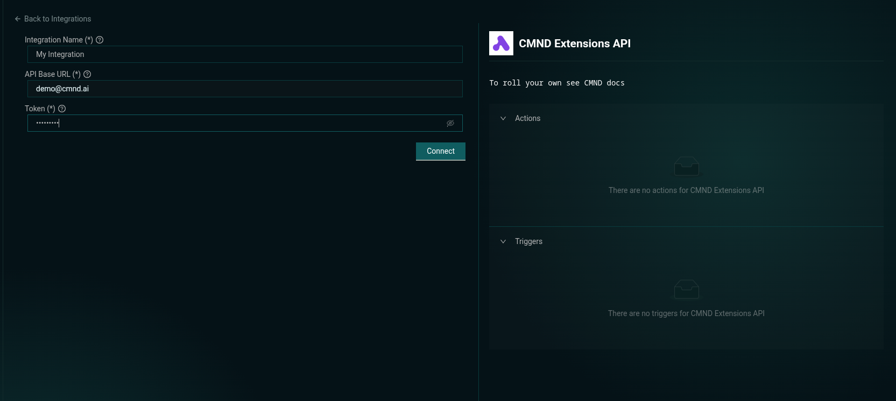
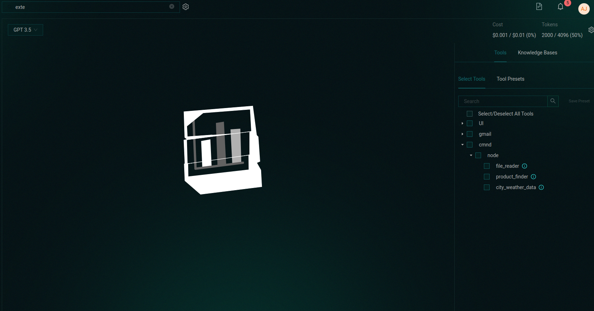

# Connecting Your Tool to CMND.ai

Once your tool server is running and publicly accessible, you’re ready to connect it to CMND.ai.

This will make your tool available inside conversations and assistants.

---

## Step 1: Open the CMND Dashboard

Go to [app.cmnd.ai](https://app.cmnd.ai) and log in to your account.

From the sidebar, navigate to the **Connections** section:

---

## Step 2: Create a CMND Extension Connection

1. On the **Connections** screen, click the "New Connection" button in the top right corner.

2. In the search bar enter "CMND Extensions API" an dselect the result.

2. Fill in the required fields:

   - **Integration Name**: Give your connection a recognizable name
   - **API Base URL**: This is the public URL of your tool server (e.g., from Ngrok)
   - **Token**: If your extension requires a token enter one, otherwise leave the default value

   

   :::warning
   Do **not** include a trailing `/` at the end of the API URL.
   :::

3. Submit the form. If everything is correct, you’ll see a confirmation:

   

---

## Step 3: Attach the Tool to a Conversation

1. Go to the **Conversations** section in the sidebar.
2. Select the assistant or conversation you want to enhance.
3. Scroll to the **Tools** section, and locate the CMND Extension collapse — you should see your tools listed there.

   

---

## ✅ That’s It

Your custom tools are now live inside CMND. Assistants can call them as part of natural conversations — giving you a bridge between language models and your own logic, data, and systems.
