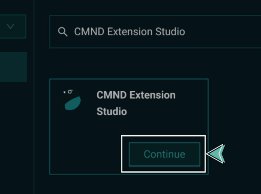

import Tabs from '@theme/Tabs';
import TabItem from '@theme/TabItem';

# Extensions Studio

The CMND Extensions Studio provides an easier way to create and connect custom tools to CMND — without needing to deploy your own server.

It offers the same functionality as building through the Extensions API, but streamlines the process by allowing you to develop, configure, and host your tool directly inside the CMND platform.

:::note
This guide walks through how to create and deploy a custom tool using JavaScript or Python inside the CMND Extensions Studio.
:::

---

## How to Use the Extensions Studio

### 1. Open the CMND Dashboard

- Go to [app.cmnd.ai](https://app.cmnd.ai) and log in to your account.
- From the sidebar, navigate to the **Connections** section.

  

---

### 2. Launch the Extensions Studio

- In the search bar, enter "CMND Extension Studio" and select it from the results.

  

---

### 3. Configure Your Tool

- Enter the name of your new tool.
- Choose your development language (**Python** or **JavaScript**).
- Click **Start**.

  <!--  -->

  Once you click Start, you’ll be taken to the code editor with a boilerplate project ready, depending on the language you chose.

---

## Defining Your Tool

Each project will contain a base file (`tools.py` or `tools.js`) where you define your tool logic, input schema, and metadata.

<Tabs>
<TabItem value="python" label="Python" default>

Inside `tools.py`:

```python title="tools.py" showLineNumbers
from pydantic import BaseModel, Field
import httpx
import os

class WeatherCitySchema(BaseModel):
    city: str = Field(..., title="City", description="City name required")

async def weather_from_location(city: str):
    api_key = os.getenv('WEATHER_API_KEY')
    url = f"https://api.openweathermap.org/data/2.5/weather?q={city}&appid={api_key}"
    async with httpx.AsyncClient() as client:
        response = await client.get(url)
        return response.json()

tool = [
    {
        "name": "weather_from_location",
        "description": "Gets the weather details from a given city name",
        "parameters": WeatherCitySchema.schema(),
        "runCmd": weather_from_location,
        "isDangerous": False,
        "functionType": "backend",
        "isLongRunningTool": False,
        "rerun": True,
        "rerunWithDifferentParameters": True
    }
]
```

- Use **Pydantic** to define your input schema
- Write the tool's logic
- Register the tool by adding it to the `tool` array

</TabItem>

<TabItem value="javascript" label="JavaScript">

Inside `tools.js`:

```javascript title="tools.js" showLineNumbers
const axios = require("axios");
const yup = require("yup");
const yupToJsonSchema = require("./yupToJsonSchema");

const WeatherSchema = yup.object({
  city: yup.string().required(),
});

const WeatherTool = {
  name: "weather_from_location",
  description: "Fetches current weather for a given city",
  category: "weather",
  subcategory: "forecast",
  functionType: "backend",
  dangerous: false,
  associatedCommands: [],
  prerequisites: [],
  parameters: yupToJsonSchema(WeatherSchema),
  rerun: true,
  rerunWithDifferentParameters: true,
  runCmd: async ({ city }) => {
    try {
      const response = await axios.get(
        `https://api.openweathermap.org/data/2.5/weather?q=${city}&appid=${process.env.WEATHER_API_KEY}`
      );
      return JSON.stringify(response.data);
    } catch (err) {
      return "Error trying to execute the tool";
    }
  },
};

const tools = [WeatherTool];
module.exports = tools;
```

- Use **Yup** to define your input schema
- Implement the tool logic
- Export your tool properly for CMND to pick up

</TabItem>
</Tabs>

---

## Deploying Your Tool

Once you finish defining your tool:

- Click the **Deploy** button in the Extensions Studio editor.
- CMND will build and host the tool for you automatically.
- Your tool will be available immediately inside the platform for use in conversations and assistants.

---

The CMND Extensions Studio allows you to go from an idea to a live, integrated tool — without worrying about servers, hosting, or infrastructure.
