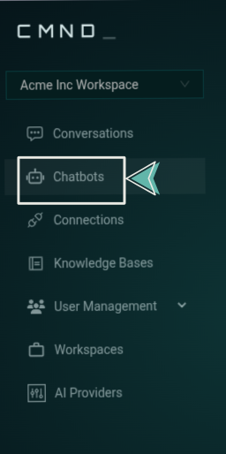

import Tabs from '@theme/Tabs';
import TabItem from '@theme/TabItem';

# Installation & Setup

The CMND Embed Widget allows you to add a powerful AI chatbot to your website with minimal effort. No complex frameworks or React required—just add a script to your page and you're ready to go.

:::note
This guide walks you through the complete process from creating a chatbot on the CMND platform to embedding it on your website using simple HTML and JavaScript.
:::

## Step 1: Create a Chatbot on CMND.ai

Before adding the widget to your website, you'll need to create a chatbot on the CMND dashboard:

1. **Sign up or log in** to your CMND account at [cmnd.ai](https://calendly.com/ersel-aker/cmnd-ai-exploration) if you haven't already

2. **Navigate to the Chatbots section** in the sidebar

   

3. **Click "Create Chatbot"** in the top-right corner

4. **Select "Embed Chatbot"** from the options

   

5. **Configure your chatbot** in the General tab (title, model type, output token length, cost limit, token limit, system prompt).

   > You can start with the default settings and adjust later as needed

   

6. **Click "Create Chatbot"** to finalize

:::info
After creation, navigate to the **Embed** tab and copy your `chatbotID` and your `organizationID`. You'll need these identifiers for the next step.
:::

## Step 2: Add the Widget Script

Add the CMND widget script to your website by placing this code in the `<head>` section of your HTML:

```html title="HTML" showLineNumbers
<script src="https://embed.cmnd.ai/widget.js"></script>
```

This loads the necessary JavaScript to display and operate the chatbot widget.

## Step 3: Initialize the Chatbot

Initialize the widget with your credentials using the `window.cmndChat()` method:

```jsx title="JavaScript" showLineNumbers
window.cmndChat("init", {
  chatbot_id: "YOUR_CHATBOT_ID",
  organization_id: "YOUR_ORG_ID",
});
```

Replace `YOUR_CHATBOT_ID` and `YOUR_ORG_ID` with the values copied from the CMND dashboard.

## Implementation Examples

<Tabs>
<TabItem value="in-head" label="Script in <head>" default>

```html title="HTML" showLineNumbers
<!DOCTYPE html>
<html lang="en">
  <head>
    <meta charset="UTF-8" />
    <meta name="viewport" content="width=device-width, initial-scale=1.0" />
    <title>My Website with CMND Chat</title>

    <!-- CMND Widget Script -->
    <script src="https://embed.cmnd.ai/widget.js"></script>

    <!-- Initialize when DOM is ready -->
    <script>
      document.addEventListener("DOMContentLoaded", function () {
        window.cmndChat("init", {
          chatbot_id: "YOUR_CHATBOT_ID",
          organization_id: "YOUR_ORG_ID",
        });
      });
    </script>
  </head>
  <body>
    <!-- Your website content -->
  </body>
</html>
```

:::warning Important
When initializing the widget from a script in the `<head>`, always wrap your code in a `DOMContentLoaded` event listener to ensure the page has loaded before the widget is initialized.
:::

</TabItem>

<TabItem value="in-body" label="Script in <body>">

```html title="HTML" showLineNumbers
<!DOCTYPE html>
<html lang="en">
  <head>
    <meta charset="UTF-8" />
    <meta name="viewport" content="width=device-width, initial-scale=1.0" />
    <title>My Website with CMND Chat</title>

    <!-- CMND Widget Script -->
    <script src="https://embed.cmnd.ai/widget.js"></script>
  </head>
  <body>
    <!-- Your website content -->

    <!-- Initialize at the end of body -->
    <script>
      window.cmndChat("init", {
        chatbot_id: "YOUR_CHATBOT_ID",
        organization_id: "YOUR_ORG_ID",
      });
    </script>
  </body>
</html>
```

:::tip
When placing the initialization script at the end of the `<body>`, no event listener is needed since the DOM is already loaded at that point.
:::

</TabItem>
</Tabs>

For additional support, contact our team at [info@cmnd.ai](mailto:info@cmnd.ai).
