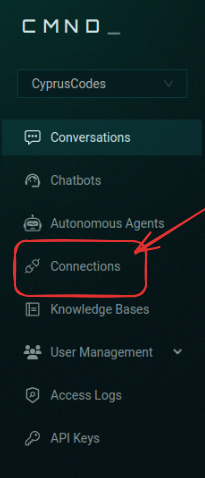
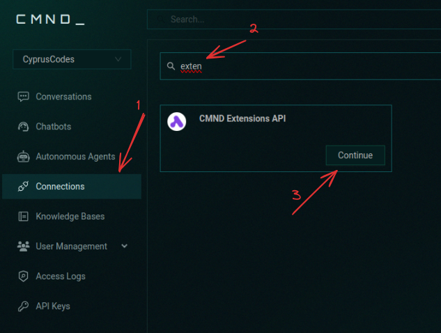
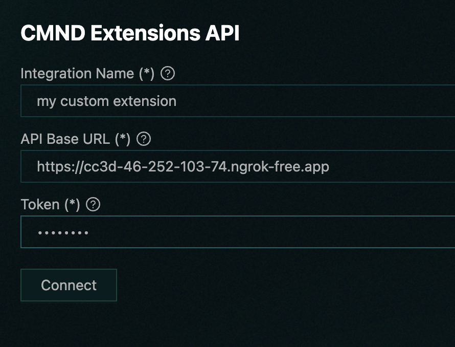
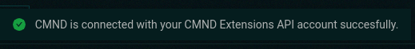
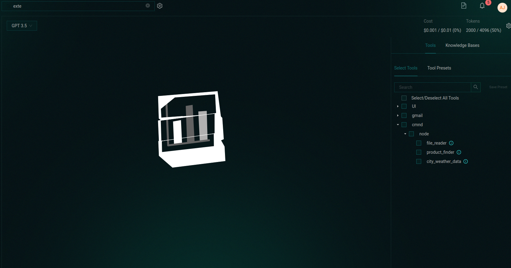

# Connect Tools 

## Setting Up CMND Tools

After setting up your tools and running your server, time to connect !

### Setting Up the CMND

Head over to **[app.cmnd.ai](https://app.cmnd.ai)**

After logging in, head over to the connections from the sidebar

Then on the connections screen find cmnd extension

and add your connection's details:

make sure that there is no `/` at the api url.

after adding the connection you will be prompted with a successfull message like:

Head back to the conversations and selesct your conversation

then you will see the tool section with cmnd collapse where you will find the tools coming from your external api

✅ And DONE! You can now select from the available tools and use them when necessary.
