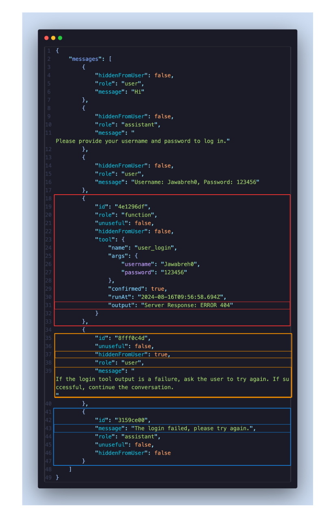

# Post Tool Call Prompting

## Overview

In AI-driven applications, ensuring the smooth interaction between users, tools, and the LLM is essential. To address the challenge of controlling LLM behavior based on tool outputs, we are introducing a technique called Post-Tool Call Prompting. This technique allows developers to adjust the behavior of the LLM after the tool executes and before the LLM gives the results to the user, enabling specific flows based on the outcomes of the tools used.

## What is Post-Tool Call Prompting?

Post-Tool Call Prompting is a strategy where a message with a role of "user" and the property "hiddenFromUser": true is injected into the conversation. Although this message is invisible to the user, it serves an essential function for the LLM, guiding its behavior when working with tools. This hidden message helps create pre-defined conditions and actions for the LLM to follow based on the tool's execution results.

By utilizing this technique, you can condition the LLM to respond differently depending on the outcome of tool operations, thus improving the flow and user experience.

## How can we implement Post-Tool Call Prompting in CMND? 

Consider the example where a user is logging into a system. The process involves the user providing their username and password, which are then sent to a backend tool to validate the credentials. The flow of the conversation with the LLM may need to adjust based on the tool's response—whether it's a success or failure.

## Here is how Post-Tool Call Prompting comes into play:

1. User Interaction:
The user provides their login credentials, which are passed to the backend tool to process.

2. Post-Tool Call Prompting:
A hidden message is sent with the role of "user" and "hiddenFromUser": true. This message contains instructions that condition the behavior of the LLM based on the tool's output.

Here’s a visual example to illustrate how this technique is implemented.

 

Flow of Messages: The flow of messages in the conversation would look like this:

In this flow, after the tool attempts to validate the user's credentials, the hidden message will prompt the LLM to handle the failure case by asking the user to retry. This is all done without the user being aware of the hidden instructions guiding the LLM's behavior.

## Conclusion
Post-Tool Call Prompting is a powerful technique that allows developers to adjust the behavior of LLMs in real time based on the outcomes of tool executions. By injecting hidden messages that guide the LLM after a tool completes, developers can manage different scenarios such as failures or successes more effectively, ensuring that users have a smooth and intuitive experience.

This technique is particularly useful for applications that rely heavily on backend tools to process user requests, as it provides a seamless way to handle complex workflows without compromising the user experience.