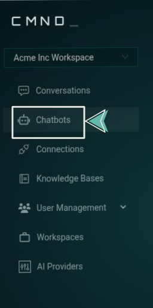
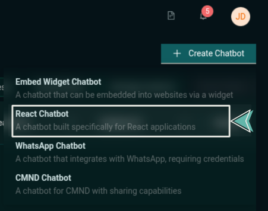
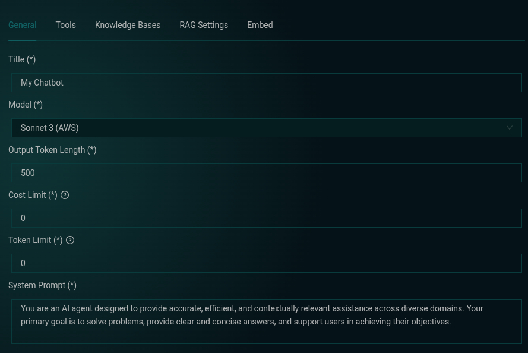

# Quickstart with CMND.ai

To get you started, this guide will walk you through the simplest way to use CMND.ai — by creating a chatbot and embedding it into a React application.

:::note What you'll achieve
You'll have a working AI chatbot in your React app in just a few minutes.
:::

## 1. Create a Chatbot on CMND.ai

Before jumping into code, you'll need a CMND account.

<details>
<summary>Don't have an account yet?</summary>

If you don't have a CMND account, [sign up here](https://calendly.com/ersel-aker/cmnd-ai-exploration).

</details>

Once you're logged in:

1. Navigate to the **Chatbots** section from the sidebar.  
   

2. Click the **Create Chatbot** button in the top-right corner.

3. Choose the **React Chatbot** option.  
   

4. Configure your chatbot in the **General** tab (title, model type, output token length, cost limit, token limit, system prompt).

   > You can start with the default settings and adjust later as needed

   

5. Click the **Create Chatbot** button in the top right corner — and just like that, your chatbot is ready to go!

## 2. Install the CMND React SDK

Inside your React project, install the SDK:

```bash title="Terminal"
npm install @cmnd-ai/chatbot-react
```

## 3. Embed the Chatbot in Your App

Now plug the chatbot into your React app by using the `ChatProvider` and `CmndChatBot` components from the SDK:

```jsx title="Javascript" showLineNumbers
import { ChatProvider, CmndChatBot } from "@cmnd-ai/chatbot-react";

const App = () => {
  return (
    <ChatProvider
      baseUrl="https://api.cmnd.ai"
      chatbotId={YOUR_CHATBOT_ID}
      organizationId={YOUR_ORG_ID}
    >
      <CmndChatBot />
    </ChatProvider>
  );
};

export default App;
```

:::caution Important
Replace `YOUR_CHATBOT_ID` and `YOUR_ORG_ID` with the actual values provided in the **Embed** tab after you create your chatbot.
:::

## Need a full example?

Check out our open-source example app: [CMND React Chatbot Example on GitHub](https://github.com/CyprusCodes/cmnd-react-chatbot-example)

## 🎉 That's it!

You now have a fully working AI chatbot running inside your React application. From here, you can explore advanced features like connecting tools, building assistants, and customizing your chatbot even further using the CMND React SDK.
